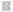

---
title: "Instrukcja laboratorium systemów wbudowanych"
subtitle: "Ćwiczenie 8: Odmierzanie czasu i definiowanie własnych znaków na wyświetlaczu alfanumerycznym"
author: [Mariusz Chilmon <<mariusz.chilmon@ctm.gdynia.pl>>]
lang: "pl"
titlepage: yes
titlepage-logo: "logo.jpg"
colorlinks: yes
header-includes: |
  \usepackage{awesomebox}
  \usepackage{gensymb}
...

> People think that computer science is the art of geniuses but the actual reality is the opposite, just many people doing things that build on eachother, like a wall of mini stones.
>
> — _Donald Knuth_

# Cel ćwiczenia

Celem ćwiczenia jest zapoznanie się z:

* odliczaniem czasu,
* formatowaniem czasu na wyświetlaczu,
* sterowaniem brzęczykiem,
* definiowaniem własnych symboli w sterowniku wyświetlacza alfanumerycznego.

# Uruchomienie programu wyjściowego

1. Umieść zworki na pinach `RS`, `E` i `D4`…`D7` złącza `J10` (na lewo od buzzera).
1. Zworkę `J15` (nad buzzerem) ustaw w pozycji `RW->GND`.
1. Umieść wyświetlacz w złączu `DIS1`.
1. Podłącz przycisk `K1` do pinu `PD0` mikrokontrolera.
1. Podłącz przycisk `K2` do pinu `PD1` mikrokontrolera.
1. Podłącz pin `BUZ` pod wyświetlaczem siedmiosegmentowym LED do pinu `PD3` mikrokontrolera.
1. Po uruchomieniu na wyświetlaczu pokaże się komunikat _Brushing time!_.

# Zadanie podstawowe

## Wymagania funkcjonalne

Celem zadania podstawowego jest oprogramowanie timera pomagającego dzieciom w nabyciu nawyku poprawnego szczotkowania zębów. Urządzenie ma odliczać czas potrzebny na umycie kolejnych ćwiartek uzębienia.

1. Po wciśnięciu przycisku `K1` rozpoczyna się odliczanie czasu w miejscu komunikatu `time!`.
1. Czas do zakończenia szczotkowania wyświetlany jest w formacie `0:00`, wskazując pozostałe minuty i sekundy.
1. Czas szczotkowania podzielony jest na cztery interwały sygnalizowane wyświetlaniem symboli `<<<` i `>>>` w czterech rogach ekranu.
1. Ukończenie każdego z pierwszych trzech interwałów sygnalizowane jest pojedynczym krótkim sygnałem dźwiękowym.
1. Ukończenie czwartego interwału sygnalizowane jest kilkoma krótkimi sygnałami dźwiękowymi.
1. Po zakończeniu odliczania wyświetlany jest ekran startowy.
1. W każdej chwili można przerwać odmierzanie czasu, wciskając klawisz `K2`, co powoduje wyświetlanie ekranu startowego.

Przykładowe stany ekranu:

```
<<< Brushing
      1:55
```

```
<<< Brushing >>>
      1:22
```

```
<<< Brushing >>>
<<<   0:42
```

```
<<< Brushing >>>
<<<   0:11   >>>
```

## Modyfikacja programu

1. W metodzie `Keypad::init()` włącz rezystory podciągające na pinach, do których podłączone są klawisze.
1. W metodzie `Keypad::key()` zwróć bieżący stan klawiatury, który będzie przekazany do `Menu::onKey()`.
1. W metodzie `Buzzer::init()` ustaw jako wyjściowy pin, do którego podłączony jest brzęczyk.
1. Uzupełnij metody `Buzzer::shortBeep()` i `Buzzer::longBeep()`, tak by sygnalizowały brzęczykiem — odpowiednio — krótki dźwięk (wystarczy 10&nbsp;ms) i kilka krótkich dźwięków.
1. Uzupełnij metody `Menu::refresh()` i `Menu::onKey()`, by zrealizować założoną funkcjonalność urządzenia.

\awesomebox[teal]{2pt}{\faCode}{teal}{Stała \lstinline{TICKS_PER_SECOND} celowo ma zaniżoną wartość, aby przyspieszyć bieg odmierzanego czasu i ułatwić testowanie programu.}

\awesomebox[teal]{2pt}{\faCode}{teal}{Można użyć zdefiniowanego typu wyliczeniowego \lstinline{enum PERIOD}, by określić poszczególne etapy procesu szczotkowania.}

\awesomebox[purple]{2pt}{\faMicrochip}{purple}{Pamiętaj o przeznaczeniu rejestrów GPIO: rejestry \lstinline{DDR} określają kierunek pinu (wejściowy lub wyjściowy), rejestry \lstinline{PIN} odczytują stan pinu, a rejestry \lstinline{PORT} sterują stanem wyjściowym lub włączają rezystory podciągające pinu wejściowego.}

\awesomebox[teal]{2pt}{\faCode}{teal}{Ponieważ dla obsługi brzęczyka odmierzamy krótkie odcinki czasu, nieopłacalne jest implementowanie ich odmierzania za pomocą timera. Użyj funkcji \lstinline{_delay_ms()} zdefiniowanej w pliku nagłówkowym \lstinline{util/delay.h}.}

# Zadanie rozszerzone

## Wymagania funkcjonalne

Celem zadania rozszerzonego jest zdefiniowanie na wyświetlaczu alfanumerycznym własnego symbolu (klepsydry) i wyświetlenie go przed odliczanym czasem:

\begin{lstlisting}[escapeinside={($}{$)}]
<<< Brushing >>>
<<<  ($\faHourglass[regular]$) 0:42
\end{lstlisting}

{width=140px}

## Modyfikacja programu

Korzystając z dokumentacji sterownika wyświetlacza alfanumerycznego HD44780 obsłuż definiowanie własnego symbolu w pamięci CGRAM.

1. Zdefiniuj komendę `CommandSetCgramAddress` analogicznie do już istniejącej komendy `CommandSetDdramAddress`.
1. W metodzie `Lcd::init()` dodaj wywołanie nowoutworzonej komendy, tak by zaadresować żądany bajt w pamięci CGRAM, np. `0x00`. Następnie wyślij 7 kolejnych wierszy z pikselami, korzystając z obiektu `Data` (zapis do pamięci CGRAM przebiega identycznie jak zapis znaków na wyświetlaczu).
1. Wyświetl nowy znak w `Menu::refresh()`.

\awesomebox[purple]{2pt}{\faMicrochip}{purple}{Sterownik HD44780 pozwala definiować własne symbole, ale zapisywane są one w pamięci nieulotnej, więc mikrokontroler musi je wgrać na nowo przy każdym uruchomieniu.}

\awesomebox[teal]{2pt}{\faCode}{teal}{Defniując symbol można skorzystać z wprowadzonych w standardzie C++14 binarnych literałów liczbowych postaci \lstinline{0b00000000}, co pozwala łatwo odwzorować w kodzie tablicę pikseli.}

\awesomebox[teal]{2pt}{\faCode}{teal}{Aby wyświetlić własny symbol wystarczy po prostu wypisać znak o odpowiednim numerze z pamięci CGRAM, np. dla pierwszego symbolu (pod adresem \lstinline{0x00}) będzie to instrukcja \lstinline{lcd.write('\\x00');}.}
